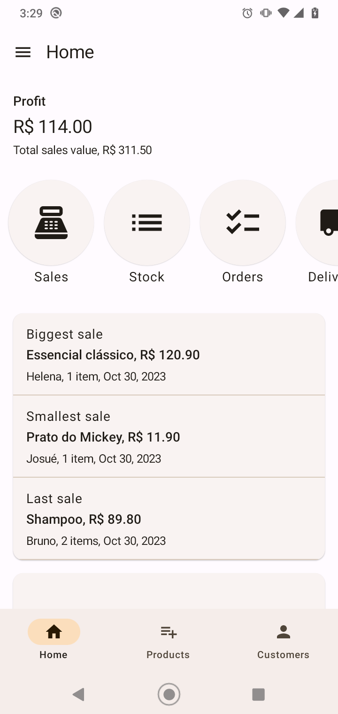
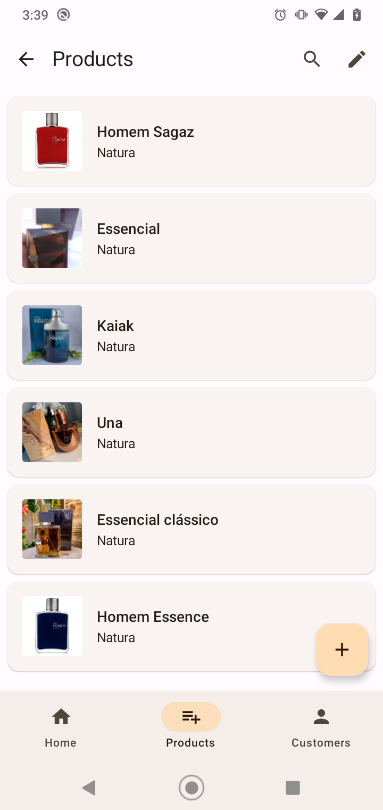
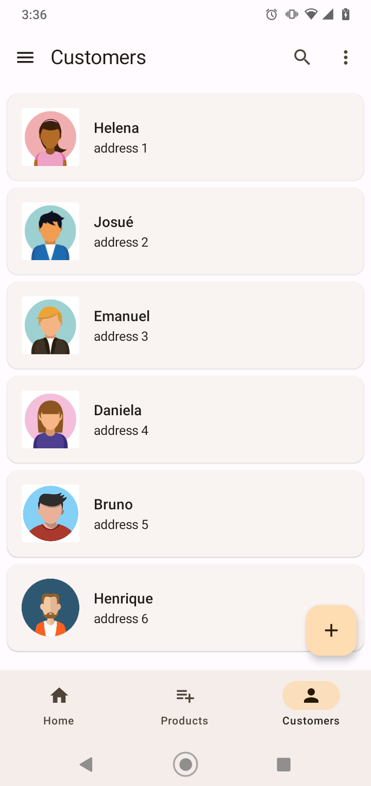
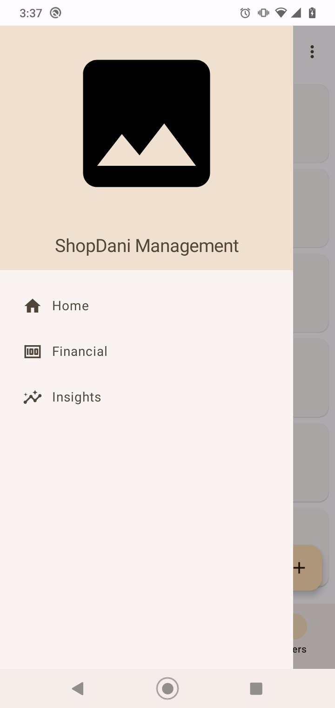
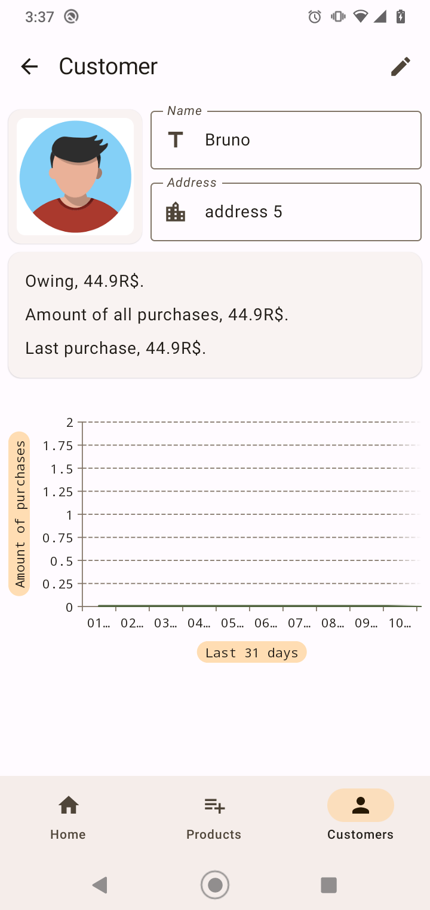
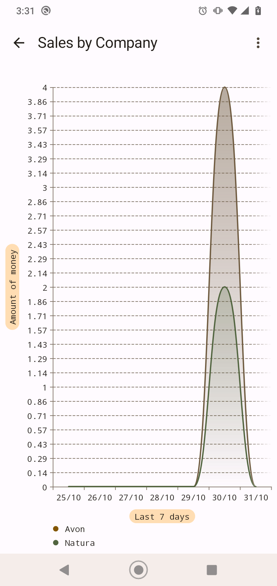

# ShopDani Management System

Manage ShopDani stock, orders, sales and customers with informative charts and financial insights. Get notifications when products are out of stock, expired and when the customer is due to make a payment.

## Main Features
* Authenticate the user to the server.
* Persist data local/server.
* Sync data.
* Informative charts.
* Notifications.

## Some Screenshots

      

      

